  

  
  

## Sobre mí

Estudiante del tecnólogo en **Análisis y Desarrollo de Software (ADSO)** en el SENA y de
**Tecnología en Desarrollo de Software** en la Universidad Surcolombiana (USCO).

Me interesa el desarrollo de software, las bases de datos y la creación de soluciones digitales
para problemas reales. Actualmente soy **Tech Lead** del equipo que construye **Bourgelat**,
una plataforma SaaS multi-tenant para la gestión de clínicas veterinarias.

Me caracterizo por ser responsable, comprometido y con disposición para aprender.

## Stack

  

## Proyectos

| Proyecto | Descripción | Tecnologías |
|----------|-------------|-------------|
| [bourgelat](https://github.com/romanlabs/bourgelat) | Sistema SaaS de gestión veterinaria: clínicas, pacientes, citas, inventario y facturación | React, Vite, Node.js, Express, PostgreSQL, Docker |
| [Bourgelat.com](https://github.com/StivenFerreira09/Bourgelat.com) | Proyecto formativo en equipo del SENA (ficha 3239137) con pipeline de integración continua | Node.js, Jest, ESLint, GitHub Actions |
| [sistema-inventario-profesional](https://github.com/romanlabs/sistema-inventario-profesional) | Sistema de inventario con login, roles (admin y cajero) y base de datos SQLite | Python, SQLite |
| [RomanBolanos-Git.github.io](https://github.com/romanlabs/RomanBolanos-Git.github.io) | Portafolio profesional | JavaScript, HTML, CSS |

<b>Formación</b>

 

| Institución | Programa | Estado |
|-------------|----------|--------|
| SENA — Centro de la Industria, la Empresa y los Servicios (Neiva) | Tecnólogo en Análisis y Desarrollo de Software (ADSO) | En formación |
| Universidad Surcolombiana (USCO) | Tecnología en Desarrollo de Software | En formación |

<b>Qué estoy trabajando ahora</b>

 

- Arquitectura multi-tenant con aislamiento de datos por clínica
- Documentación de software: requisitos, dominio (DDD) y decisiones de arquitectura (ADR)
- Seguridad: autenticación con JWT, contraseñas con bcrypt y control de acceso por roles
- Protección de datos personales bajo la Ley 1581 de 2012
- Pruebas automatizadas e integración continua

<b>Objetivo</b>

 

Seguir fortaleciendo mis conocimientos en programación y desarrollo de software para aportar
en proyectos reales y crecer profesionalmente.

 

  

